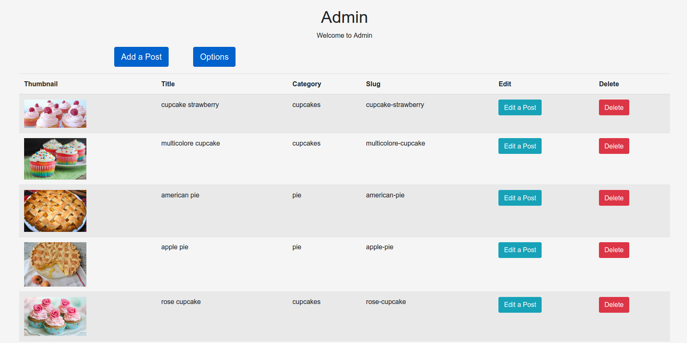
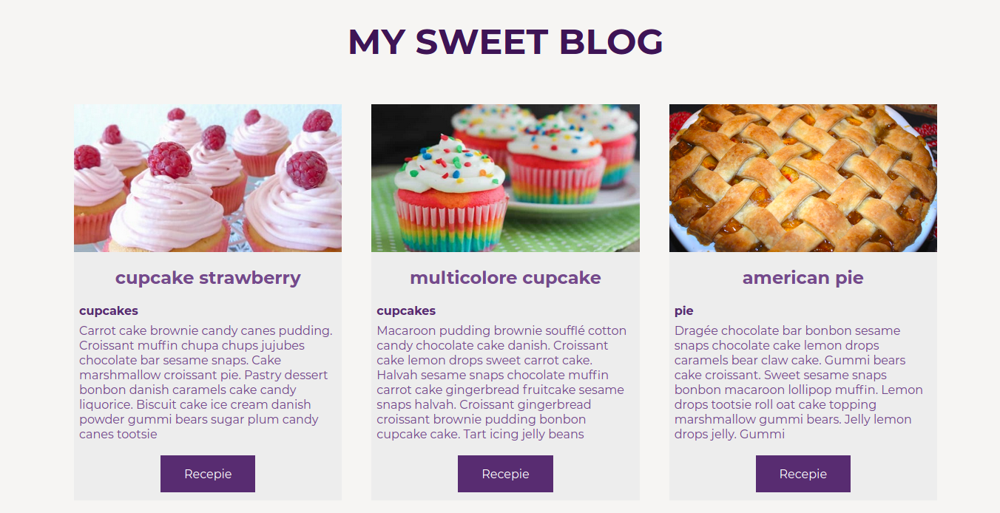

# Blog with Express, mongoDB and handlebars
<strong>In admin section, you can create categories and posts. And you have an example of frontend layout. In the admin you have an option: you can choose the longer of excerpt</strong>

<ol>
  <li>clone the repo and cd into it</li>
  <li>npm install</li>
  <li>put the password of your mongoDB cluster in app.js</li>
  <li>npm start</li>
</ol>
